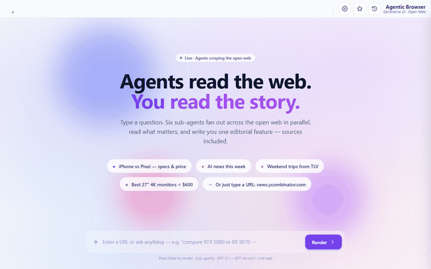

# Agentic Browser

A desktop browser whose address bar accepts **both URLs and natural-language intents**. URLs open as real Chromium tabs. Intents trigger an agent pipeline: one **planner** picks 3–6 source URLs, a **scraper sub-agent** is spawned per source (each with its own isolated browser context), they fan out in parallel, and a **synthesizer** composes one polished, magazine-style HTML article with citations.

Bring your own LLM key — OpenAI, Anthropic, or Google. Keys are sent per request as headers and stored encrypted in the OS keychain on Electron, never persisted server-side.



## Install

Download the latest installer from [Releases](https://github.com/XiRoSe/agentic-browser/releases) and double-click it. Windows only for now; macOS / Linux build targets are stubbed but untested.

The installer is unsigned, so SmartScreen will show a *"Windows protected your PC"* warning on first launch. Click **More info → Run anyway**. It installs per-user (no admin password) to `%LOCALAPPDATA%\Programs\Agentic Browser\` and adds a Start menu shortcut.

After installing, open the app, click ⚙ (top-right), pick your LLM provider, paste your API key, and you're ready.

## How it works

```
                ┌─────────────────────────────┐
                │   address bar / intent box   │
                └──────────────┬───────────────┘
                               │
              detectUrl(input)?│
                ┌──────────────┴──────────────┐
                ▼                              ▼
        URL tab                          intent
        (<webview src="…">)              │
                                         ▼
                            ┌────────────────────────────┐
                            │  Planner — orchestrator LLM │
                            │  tools: search_web          │
                            │  → ScrapePlan(jobs[])       │
                            └──────────────┬─────────────┘
                                           │
                  ── asyncio.gather (Semaphore=N) ──
                  ▼              ▼              ▼
            Scraper #1      Scraper #2      Scraper #N
            scraper LLM     scraper LLM     scraper LLM
            own BrowserCtx  own BrowserCtx  own BrowserCtx
            fetch_url →     fetch_url →     fetch_url →
            browse_* if     browse_* if     browse_* if
            needed          needed          needed
                  │              │              │
                  ▼              ▼              ▼
             [ ScrapeResult { facts[], images[], status, … } ]
                                  │
                                  ▼
                  ┌────────────────────────────┐
                  │  Synthesizer — orchestrator │
                  │  → single <div> HTML, cited │
                  └──────────────┬─────────────┘
                                 ▼
                          view_cache (SQLite)
                                 ▼
                  ┌────────────────────────────┐
                  │  intent tab renders the HTML│
                  └────────────────────────────┘
```

Throughout the scrape, `BrowseSession` fires progress events on every navigation. These stream over a FastAPI WebSocket (`/api/ws/scrape/{job_id}`) and the renderer paints a live grid of per-sub-agent thumbnails (screenshot + URL + step counter).

## Address bar heuristic

| Input | Treated as |
|---|---|
| `https://example.com/x` | URL — opens a webview tab |
| `example.com/foo` | URL — `https://` prepended |
| `localhost:3000` | URL — `http://` prepended |
| `compare RTX 5080 vs RX 9070` | Intent — agent fans out |
| `weekend trip ideas from TLV` | Intent |

Logic lives in `frontend/index.html → detectUrl()`. Anything multi-word is always treated as an intent.

## BYO LLM key — model defaults

| Provider | Default orchestrator | Default scraper |
|---|---|---|
| OpenAI | `gpt-5.1` (reasoning_effort=none) | `gpt-4o-mini` |
| Anthropic | `claude-sonnet-4-6` | `claude-haiku-4-5` |
| Google | `gemini-2.5-pro` (thinking_budget=0) | `gemini-2.5-flash` |

Both tiers are overrideable in **Settings → Advanced**. Three execution knobs are also exposed in Settings:

- **Per-agent timeout (sec)** — wall-clock per sub-agent, clamped 30–300, default 120.
- **Concurrent agents** — max sub-agents running in parallel, clamped 1–10, default 6.
- **Max words per agent** — once a sub-agent has gathered this many words of page text (post HTML-strip), the next tool call returns a STOP signal and it commits its ScrapeResult. Clamped 200–5000, default 1000.

The orchestrator also **exits early**: when N-1 of N sub-agents are done and at least 3 facts have been collected, the remaining laggard is cancelled and synthesis starts immediately. Stops one slow site from holding the user hostage at the wall-clock timeout.

Keys are sent per request as `X-LLM-Provider` and `X-LLM-Key` headers. The backend never writes them to disk; in Electron the encrypted blob lives in the OS keychain via `safeStorage`.

## Stop signals — when a sub-agent commits early

Each sub-agent loops over its tools until it emits a `ScrapeResult`. To stop them from spinning forever, two stop signals fire from inside the tools themselves:

- **403 on the first static fetch** → the next tool call returns a `stop: blocked` instruction; the agent commits `status="failed"`.
- **≥500 accumulated words** across all fetches/reads → next tool call returns `stop: budget`; the agent commits the facts it has.

If neither fires and the per-agent wall clock elapses, the orchestrator **salvages** raw text chunks the agent had collected into best-effort Facts so the synthesizer still has something real to write from, instead of falling to an empty state.

## Run from source (dev)

### 1. Backend (Python 3.11+)

```
cd backend
python -m venv venv
venv\Scripts\activate              # Windows  (or:  source venv/bin/activate)
pip install -r requirements.txt
playwright install chromium
```

### 2. Desktop shell (Electron, Node 18+)

```
cd shell
npm install
```

### 3. Run

```
cd shell
npm start
```

Electron spawns the Python backend at `127.0.0.1:8003` automatically. Settings → API key → save → ask anything.

To run the backend alone in a regular browser (no Electron):

```
cd backend
python server.py
```

Open `http://localhost:8003`. URL tabs fall back to `<iframe>`, which most sites refuse via `X-Frame-Options` — that's a real-browser-only limitation. Settings persist to `localStorage`.

## Build the installer

```
cd shell
npm run dist
```

Produces a 229MB NSIS installer at `dist-installer/Agentic-Browser-Setup-0.1.0.exe`. The build prebakes:

- The Python runtime + all deps via PyInstaller (`backend/agentic-backend.spec`)
- The Playwright `chromium_headless_shell` (~270MB unpacked) staged from `%LOCALAPPDATA%\ms-playwright` into `shell/staged/` so it ships inside the installer

### Windows host notes

On a Windows host without Developer Mode, electron-builder's `winCodeSign` extraction fails on macOS-only symbolic links inside the 7z archive. This repo includes a thin `shell/7za-wrapper.py` (built via PyInstaller into `shell/7za.exe`) that wraps the real `7za.exe.orig` and masks the harmless exit code 2 from those symlink failures. The proper fix is to enable Windows Developer Mode on the build host; the wrapper is a non-admin workaround.

The build is unsigned. For a public release, you'd want a code-signing certificate to avoid SmartScreen warnings.

## Repo layout

```
agentic-browser/
├── backend/                        Python · FastAPI · AGNO · Playwright
│   ├── server.py                   localhost:8003
│   ├── agentic-backend.spec        PyInstaller spec
│   ├── api/views.py                /api/render · /edit · /test-connection · /ws/scrape/{id}
│   ├── logic/agent/
│   │   ├── models.py               provider factory (OpenAI / Anthropic / Google)
│   │   ├── contracts.py            ScrapeJob · Fact · ImageRef · ScrapeResult · ScrapePlan
│   │   ├── prompts.py              PLANNER · SCRAPER · SYNTHESIZER
│   │   ├── orchestrator.py         plan → gather scrapers → synthesize
│   │   └── scraper.py              per-URL sub-agent + own BrowserContext + salvage
│   ├── logic/tools/
│   │   ├── search.py               search_web   (DuckDuckGo, no API key)
│   │   ├── fetch.py                fetch_url    (httpx + trafilatura)
│   │   ├── browse.py               browse_*     (Playwright + progress events + screenshots)
│   │   └── images.py               side-channel image extraction for the synthesizer
│   ├── logic/cache/
│   │   ├── view_cache.py           (user_id, intent) → HTML
│   │   └── scrape_cache.py         (url, goal_hash) → ScrapeResult  (TTL'd)
│   └── logic/favorites/favorites.py  saved-view library (sqlite)
├── frontend/
│   └── index.html                  single-file UI (works in Electron AND in a browser)
└── shell/                          Electron desktop app
    ├── package.json                electron-builder NSIS config
    ├── main.js                     spawns the bundled backend exe in packaged mode
    ├── preload.js                  window.electronAPI bridge
    └── stage-chromium.js           pre-build step: copies Playwright Chromium for bundling
```

## Configuration (env, backend)

| Var | Default | Purpose |
|---|---|---|
| `PORT` | `8003` | Backend port |
| `SCRAPE_CONCURRENCY` | `6` | Default max sub-agents in parallel (overridable per-request via `X-Scrape-Concurrency`) |
| `SCRAPE_CACHE_TTL` | `900` | Seconds — scrape results are short-lived |
| `ORCHESTRATOR_REASONING_EFFORT` | `none` | GPT-5.x: `none`/`low`/`medium`/`high` |
| `AGENTIC_BACKEND_EXTERNAL` | _unset_ | If `1`, Electron does not spawn its own backend (use your own `python server.py`) |
| `AGENTIC_DEVTOOLS` | _unset_ | If `1`, open Electron DevTools on launch |
| `AGENTIC_FRONTEND_DIR` | _unset_ | Override frontend dir lookup (set automatically by Electron in packaged builds) |
| `PLAYWRIGHT_BROWSERS_PATH` | _unset_ | Standard Playwright env; Electron sets it to the bundled `ms-playwright` dir in packaged builds |
| `AB_KEEP_CACHE` | _unset_ | If `1`, do NOT wipe `view_cache` + `scrape_cache` on startup (default behaviour wipes them for clean testing) |

## Status

v0.1 — desktop installer, intent + URL address bar, planner→scrapers→synthesizer pipeline, live sub-agent progress grid, BYO key for 3 providers, favorites, salvage on timeout, editorial-style HTML output with images and citations. Known follow-ups:

- Code-sign the Windows installer
- macOS + Linux build targets
- Migrate from Electron `<webview>` to `WebContentsView` (webview is deprecated)
- Real omnibar autocomplete (history + suggested intents)
- Per-tab session persistence for URL tabs (cookies survive restart)
- Multi-window

## License

MIT — see [LICENSE](LICENSE).
